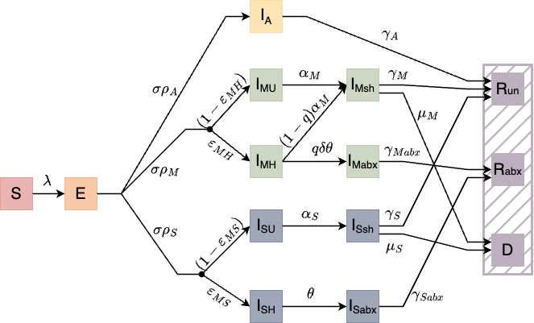
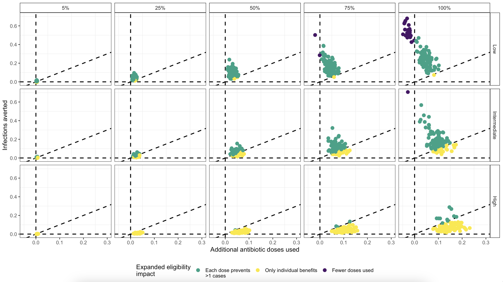
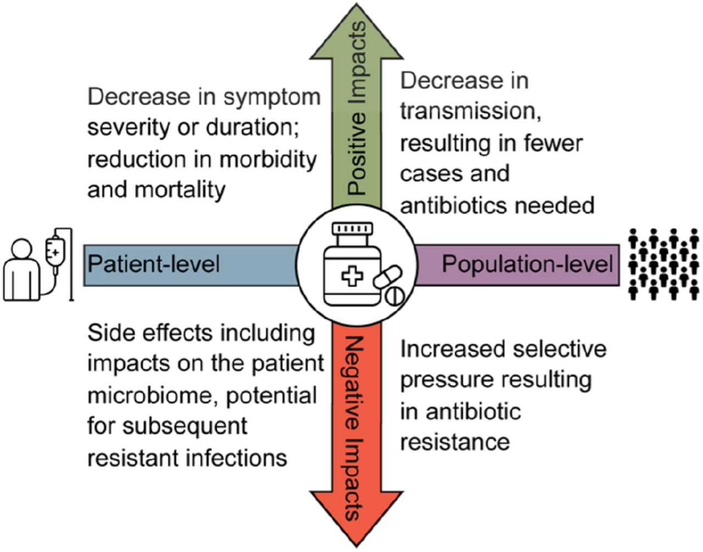
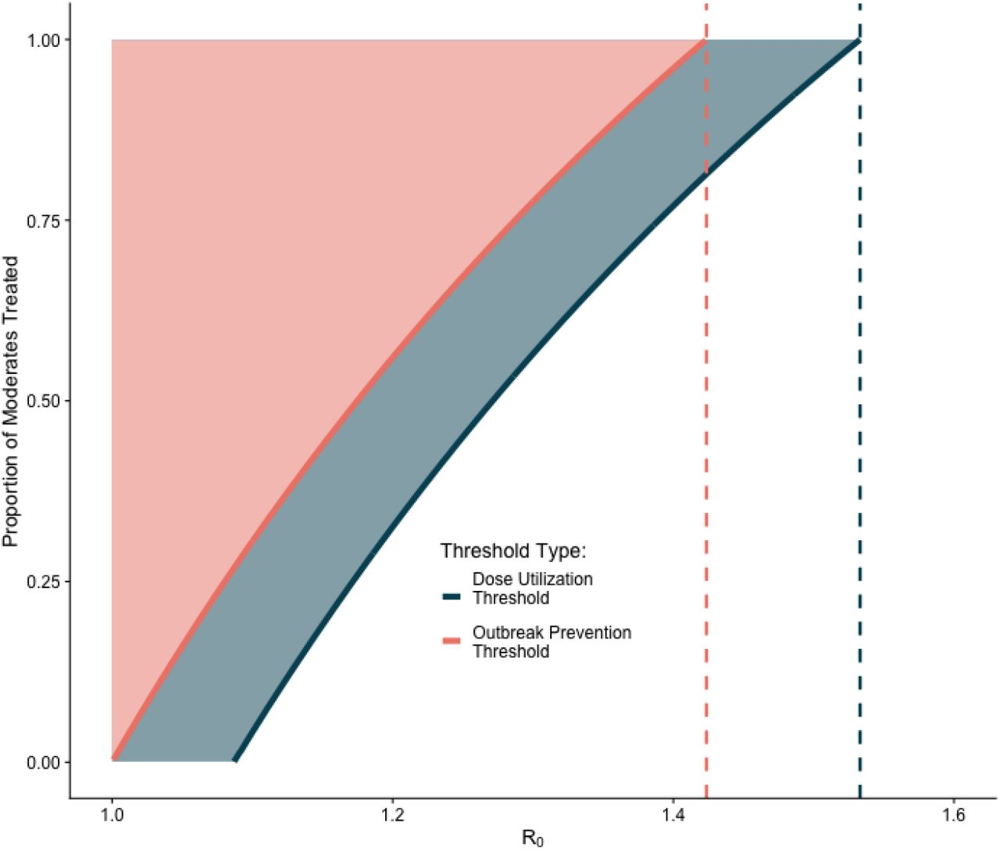

# Quantifying the Impact of Expanded Antibiotic Treatment on Cholera Outbreaks: A Theoretical and Applied Framework

This project combines the theoretical and applied research from two studies to explore and quantify the effects of expanding antibiotic treatment to include moderately symptomatic cholera infections. 

## Overview

The project is divided into two main components:

1. **Quantifying the Impact of Expanded Antibiotic Treatment on Cholera Outbreaks:** This section focuses on assessing how expanding antibiotic treatment guidelines to include moderately symptomatic cholera infections could influence the overall burden of cholera and antibiotic stewardship. The primary goal is to quantify the impact of such a policy change on outbreak dynamics and antibiotic usage.

2. **A Theoretical Framework to Quantify the Tradeoff Between Individual and Population Benefits of Expanded Antibiotic Use:** This part of the project develops a mathematical framework to explore scenarios where expanded antibiotic treatment could be beneficial for both individual and population health. By analyzing the conditions under which treating moderate infections can decrease transmission and reduce the total number of antibiotic doses administered, we aim to provide a comprehensive understanding of the potential benefits and risks associated with this strategy.[Read the preprint here](https://www.medrxiv.org/content/10.1101/2024.08.28.24312731v1.full)

## Quantifying the Impact of Expanded Antibiotic Treatment on Cholera Outbreaks

by Sharia Ahmed, Cormac LaPrete, Iza Ciglenecki, Andrew Azman, Daniel Leung, Lindsay Keegan

To assess the impact of expanded antibiotic treatment guidelines to include moderately symptomatic infections on cholera outbreaks, we simulate cholera transmission in a non-endemic setting using a compartmental model (Figure 1). Our objective was to assess how such a policy change could impact the overall burden of cholera as well the impact on antibiotic stewardship. We evaluate the impact treating moderately symptomatic infections with antibiotics different outbreak scenarios (varying $$R_e$$), different treatment-seeking scenarios (varying the proportion of moderate infections who seek treatment), and different treatment guidelines (varying the proportion of treatment-seeking moderate infections who recieve antibiotics). 

  

Figure 1: Compartmental diagram of the cholera transmission model. All individuals start as susceptible (S) and become exposed (E) at a rate $$\lambda$$. Exposed individuals transition to the infected (I) compartment and we differentiate by symptoms ($$I_A,I_M,I_S$$, asymptomatic, moderate or severely symptomatic, respectively) and by treatment seeking behavior $$(I_{U}, I_H)$$, not healthcare seeking and healthcare seeking, respectively). All severely symptomatic infections are treated with antibiotics whereas not all moderately symptomatic infections who seek treatment receive antibiotics. The proportion of healthcare seeking moderate infections who receive antibiotics is governed by q. Untreated infections, both moderate and severe continue to shed for a longer duration following the resolution of symptoms ($$I_{Msh},I_{Ssh}$$), occurring at rate $$\alpha_M,\alpha_S$$, respectively, moderately symptomatic infections who are treated with antibiotics continue to shed for a shorter duration following treatment ($$I_{Mabx}$$), occurring at rate $$\delta\theta$$, whereas severely symptomatic infections who are treated with antibiotics remain in a treatment facility and do not contribute to transmission ($$I_{Sabx}$$). Infectious individuals either recover (R, at rates $$\gamma_A,\gamma_M,\gamma_{Mabx},\gamma_S,\gamma_{Sabx}$$) or die (D, at rates $$\mu_M,\mu_S$$) and we differentiate between individuals who recover without antibiotic treatment ($$R_{un}$$) and those who recover with antibiotics ($$R_{abx}$$) to compare the number of doses used under different treatment scenarios.

Through simulation, we show that expanding treatment guidelines to include moderately symptomatic infections can substantially reduce the burden of cholera in low and intermediate transmission settings, especially when rates of treatment-seeking behavior is high. Further, in some scenarios, we find that expanding antibiotic treatment criteria provides a public health benefit, as each additional dose averts more than one infection and in limited scenarios, we showed that expanding antibiotic treatment criteria results in fewer antibiotic doses used over the course of an outbreak compared to current treatment practices (Figure 2). 

  

Figure 2: Plot of population-level impact of expanded antibiotic treatment guidelines. Each plot shows the proportion of infections averted by the proportion of additional antibiotic doses used by proportion of all moderate infections who receive treatment (5%, 25%, 50%, 75%, 100%) and R_e scenario (low, intermediate, high). The outcomes are split into three regions by the impact of expanded eligibility criteria: between the dashed line along the x-axis (expanding criteria averts no infections) and the diagonal dashed line (each addition dose of antibiotics deployed averts one infections), points colored yellow, in which expanded eligibility only has individual-level benefits; between the diagonal dashed line and the vertical dashed line (no additional doses are used to avert infections), points colored green, in which expanded eligibility results in each dose preventing more than one additional infection; and the region left of the vertical dashed line, points colored purple, in which expanded eligibility results in fewer doses used over the course of the outbreak than compared to current antibiotic treatment guidelines.

### Abstract

### Software implementation

All source code used to generate the results and figures in the paper are in the `AppliedFrmwk/code` folder and instructions for running the model and generating the outputs are in the `README.md` file. 

## A Theoretical Framework to Quantify the Tradeoff Between Individual and Population Benefits of Expanded Antibiotic Use

by Cormac LaPrete, Sharia Ahmed, Damon Toth, Jody Reimer, Valerie Vaughn, Frederick Adler, Lindsay Keegan

The global rise in antibiotic resistance poses a significant public health threat, that adds complexity to the clinical challenge of ensuring that the right antibiotic is prescribed to the right patient at the right dose for the right duration, to maximize benefits and minimize harm. Antibiotic resistance necessitates balancing the potential benefits and risks of antibiotic use for individual patients alongside broader implications for public health. While antibiotics have clear individual harms and benefits, it has been primarily thought that the impact of antibiotic prescribing at the population-level may be limited to the adverse effects of the development of resistence. Here, we propose that there may be scenarios under which prescribing antibiotics benefits public health; an idea absent from most antibiotic discourse (Figure 3).

  

Figure 3: Schematic of individual and population-level harms and benefits of antibiotic use. The horizontal axis describes the individual (patient-level) and population-level impacts and the vertical axis describes the benefits (positive impacts) and harms (negative impacts) of antibiotic usage.

We demonstrate a mechanism by which antibiotic use can offer population-level benefits through reduced transmission as a result of antibiotic treatment. That is, treating highly infectious individuals who may not require treatment to recover can reduce overall disease transmission, resulting in fewer total cases and/or fewer total antibiotic doses over the course of an outbreak. We explore this using cholera as a case study. In this paper, we analytically solve for two thresholds to characterize these tradeoffs and use simulation to identify the conditions under which expanded antibiotic treatment to include moderate cholera infections presents a population-level benefit by reducing cholera transmission, outbreak persistence, and total antibiotic use. We identify the conditions under which these thresholds occur. We show that $$\mathcal{R}(q) \leq R_{opt} = 1.424$$, below which treating moderate infections can reduce the effective reproductive number below 1, stopping the outbreak before it can spread (the outbreak prevention threshold [OPT]). Similarly, when $$\mathcal{R}(q = 0) \leq R_{dut} = 1.533$$, treating moderate infections results in fewer doses used over the course of the outbreak than under current treatment guidelines (the dose utilization threshold [DUT]) (Figure 4). Because the range of reproductive numbers for cholera outbreaks is 1.1-2.7, only outbreaks with low to intermediate reproductive numbers can benefit from expanded antibiotic treatment.

  

Figure 4: Plot of the threshold values for dose reduction (DUT) and outbreak prevention (OPT), by $$\mathcal{R}(q = 0)$$, for each proportion of moderates treated ($$M_{abx}$$). For a each value of $$\mathcal{R}(q = 0)$$, the pink curve shows the OPT of $$\mathcal{R}(q = 0)$$ and $$M_{abx}$$, the shaded region above the curve shows all combinations of $$\mathcal{R}(q = 0)$$ and $$M_{abx}$$ in which treating moderate infections reduces the effective reproductive number, $\mathcal{R}(q)$, below 1. The dotted red line indicates $R_{opt}$ for cholera. The blue curve shows the DUT of $$\mathcal{R}(q = 0)$$ and $$M_{abx}$$, the shaded region above the curve shows all combinations of of $$\mathcal{R}(q = 0)$$ and $$M_{abx}$$ in which fewer doses are given overall with expanded treatment. The dotted blue line indicates $$R_{dut}$$ for cholera. Outside of these regions, in the white space, there is no outcome improvement.

### Abstract

The use of antibiotics during a disease outbreak presents a critical tradeoff between immediate treatment benefits to the individual and the long-term risk to the population. Typically, the extensive use of antibiotics has been thought to increase selective pressures, leading to resistance. This study explores scenarios where expanded antibiotic treatment can be advantageous for both individual and population health. We develop a mathematical framework to assess the impacts on outbreak dynamics of choosing to treat moderate infections not treated under current guidelines, focusing on cholera as a case study. We derive conditions under which treating moderate infections can sufficiently decrease transmission and reduce the total number of antibiotic doses administered. We identify two critical thresholds: the Outbreak Prevention Threshold (OPT), where expanded treatment reduces the reproductive number below 1 and halts transmission, and the Dose Utilization Threshold (DUT), where expanded treatment results in fewer total antibiotic doses used than under current guidelines. For cholera, we find that treating moderate infections can feasibly stop an outbreak when the untreated reproductive number is less than 1.424 and will result in fewer does used compared to current guidelines when the untreated reproductive number is less than 1.533. These findings demonstrate that conditions exist under which expanding treatment to include moderate infections can reduce disease spread and the selective pressure for antibiotic resistance. These findings extend to other pathogens and outbreak scenarios, suggesting potential targets for optimized treatment strategies that balance public health benefits and antibiotic stewardship.

### Software implementation

All source code used to generate the results and figures in the paper are in the `TheoryFrmwk/code` folder and instructions for running the model and generating the outputs are in the `README.md` file. 

